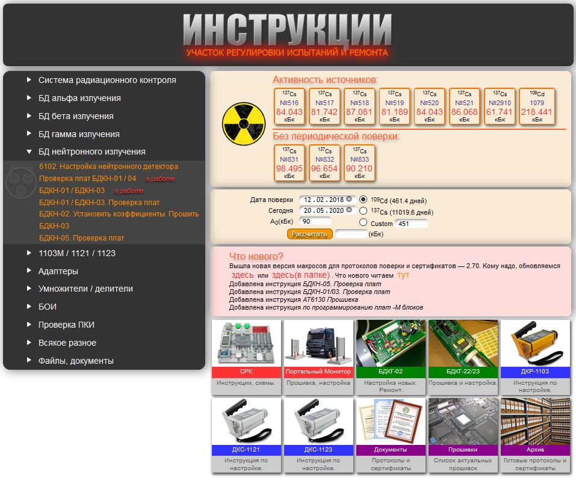

# AtomNet
Device Settings Instructions
# Инструкции для Участка Регулировки Испытаний и Ремонта

* Настройка СРК
* БД альфа-излучения
* БД бета-излучения
* БД гамма-излучения
* БД нейтронного излучения
* 1103, 1121, 1123
* Адаптеры
* Умножители / делители
* БОИ
* Проверка ПКИ
* Всякое разное
* Файлы, документы

[Список версий](VERSION.md)